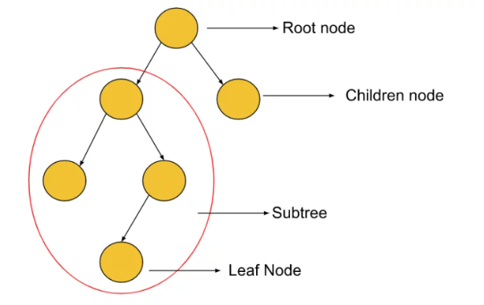
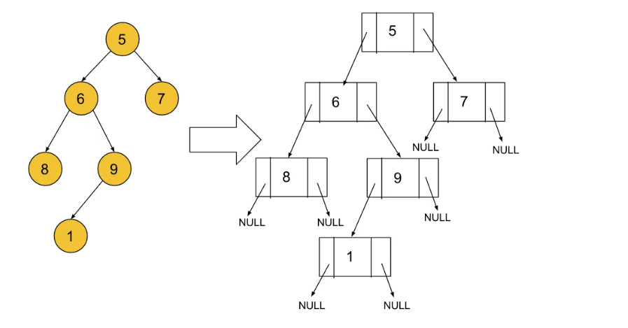
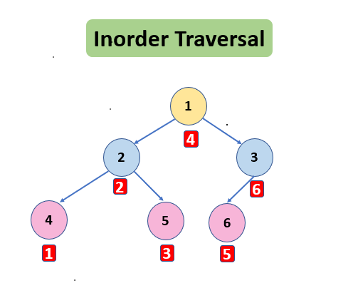
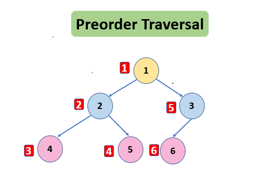
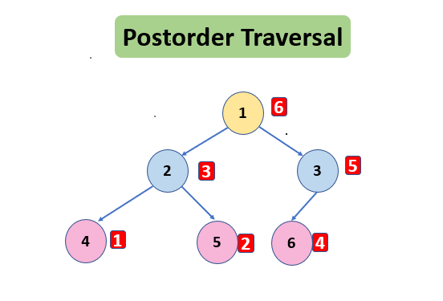

# Concepts used in this section 
- A Tree is a hierarchical data structure that is different from linear data structures like arrays, linked lists, stacks, and queues.
- A subtree is a part of the tree below any chosen node that can be considered as a separate tree with that node as a root node. Subtree is very much similar to the sub-directory which lies inside of a root directory as in our computer systems.

- A Binary Tree is a type of tree in which **each node cannot have more than 2 children nodes**.
- The root node of a Binary Tree is the top-most node from where the tree hierarchy begins.
- Leaf nodes are those nodes that lie at the terminal part of the tree indicating the last or bottom-most part of the tree.
- Children of a node are the nodes to which the pointers from the node directly point. These nodes lie directly below or in the next hierarchical level of the chosen node.
- The ancestors of a given node are all the nodes that come before the node while traversing from the root node to the given node.

## Types of Binary Trees 
Refer: https://takeuforward.org/binary-tree/introduction-to-trees/

## Binary Tree Representation in Java 
In Java, a binary tree can be represented using a node-based approach. Each node in the tree contains a value and references to its left child and right child nodes.

- If there is no left or right child of a particular node, the respective pointer will by default point to NULL.

## Binary Tree Traversal : Inorder Preorder Postorder
Reference: https://takeuforward.org/binary-tree/binary-tree-traversal-inorder-preorder-postorder/

The tree is a non-linear data structure, unlike Linked List and Arrays. It is a hierarchical data structure that can be traversed in the following ways:-

1. Inorder Traversal
2. Preorder Traversal
3. Postorder Traversal
4. Level Order Traversal

### Inorder Traversal
Inorder Traversal is one of the tree traversals in which the left subtree is visited first then visit the root and then the right subtree is visited.

Inorder Traversal –  4 2 5 1 6 3

**Algorithm of Inorder Traversal**:

1. Traverse the left subtree
2. Print the root
3. Traverse the right subtree

### Preorder Traversal
Preorder Traversal is one of the tree traversals in which root is visited then the left subtree is visited and then the right subtree is visited.

Preorder Traversal – 1 2 4 5 3 6

**Algorithm of Preorder Traversal**:

1. Print the root
2. Traverse the left subtree
3. Traverse the right subtree

### Postorder Traversal
Postorder Traversal is one of the tree traversals in which the left subtree is visited, then the right subtree is visited, and then the root is visited.

Postorder Traversal – 4 5 2 6 3 1

**Algorithm of Postorder Traversal**:

1. Traverse the left subtree
2. Traverse the right subtree
3. Print the root
