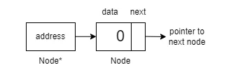

# LinkedList 
- It is a linear data structure that can be visualized as a chain with different nodes connected, where each node represents a different element. The difference between arrays and linked lists is that, unlike arrays, the elements are not stored at a contiguous location.

- Since for any element to be added in an array, we need the exact next memory location to be empty, and it is impossible to guarantee that it is possible. Hence adding elements to an array is not possible after the initial assignment of size.

# Pointers 
- A pointer is a variable that stores the memory address of another variable. In simpler terms, it “points” to the location in memory where data is stored. This allows you to indirectly access and manipulate data by referring to its memory address.

- **Java** does not explicitly use pointers or take the address of variables as you do in C++. Instead, we have reference variables. These reference variables do not directly contain memory addresses like pointers in languages such as C or C++. Instead, they hold references to objects in memory.

# Understanding the difference between Node and Node*

A node refers to the structure that contains data and the pointer to the next node. In contrast, Node* (Node pointer) specifically denotes a pointer variable that stores the address of the Node it is pointing to.

# Applications of Linked Lists
- **Creating Data Structures**: Linked lists serve as the foundation for building other dynamic data structures, such as stacks and queues.
- **Dynamic Memory Allocation**: Dynamic memory allocation relies on linked lists to manage and allocate memory blocks efficiently.
- **Web Browser** is one important application of Linked List.

