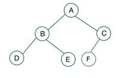
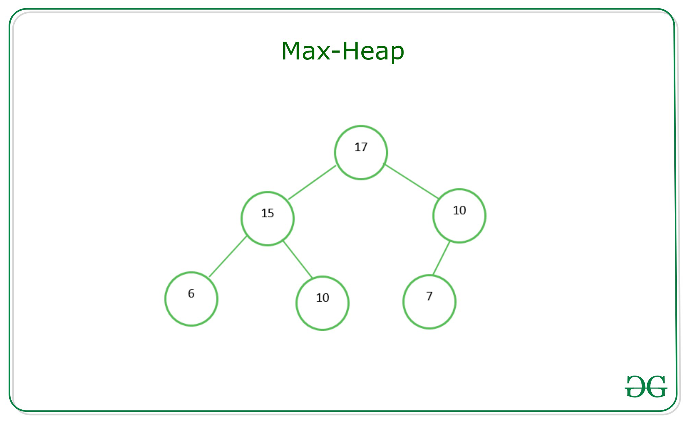

# Heap sort
Reference: https://www.geeksforgeeks.org/heap-sort/

- Heap sort is a comparison-based sorting technique based on [Binary Heap](#binary-heap) data structure.
- It is similar to the selection sort where we first find the minimum element and place the minimum element at the beginning. Repeat the same process for the remaining elements.

## Binary Heap 
- A Binary Heap is a **complete Binary Tree** which is used to store data efficiently to get the max or min element based on its structure.
- A Binary Heap is either Min Heap or Max Heap.

### Complete binary tree 
A complete binary tree is a special type of binary tree where all the levels of the tree are filled completely except the lowest level nodes which are filled from as left as possible.

### Min Heap
- In a Min Binary Heap, the key at the root must be **minimum** among all keys present in Binary Heap.
- The same property must be recursively true for all nodes in Binary Tree.

Example: 

### Max Heap
- In a Max Binary Heap, the key at the root must be **maximum** among all keys present in Binary Heap.
- The same property must be recursively true for all nodes in Binary Tree.

Example: 

